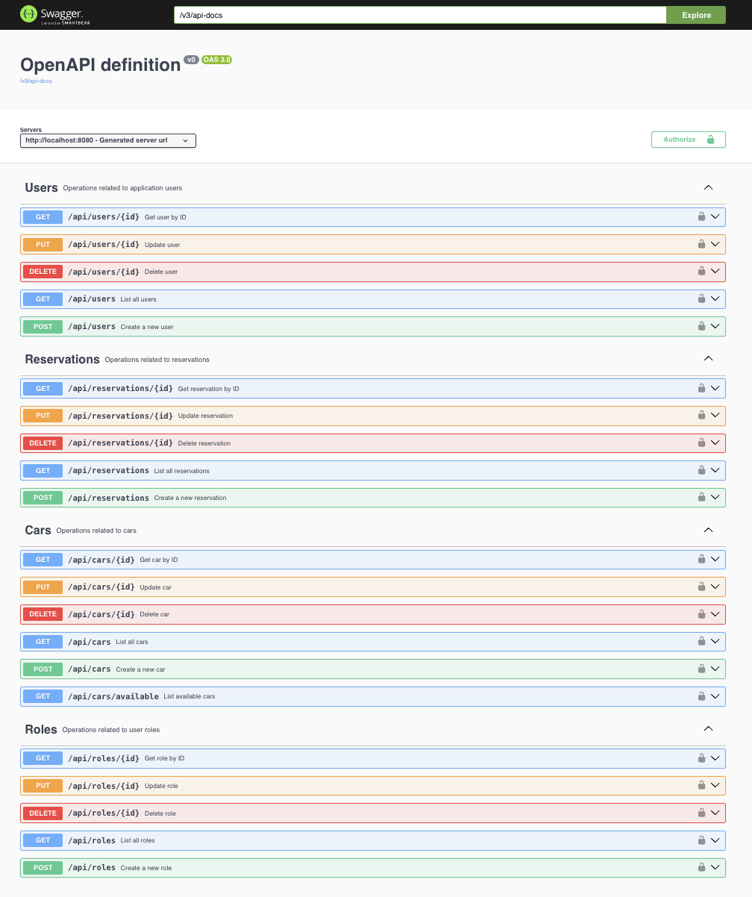
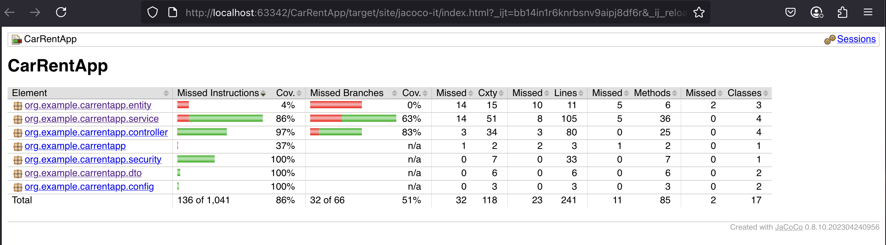
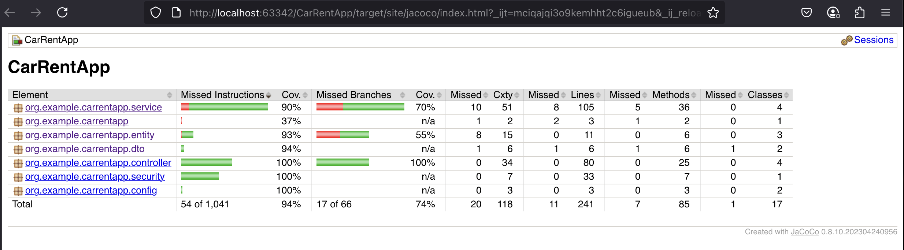

# CarRentApp

## Opis projektu

CarRentApp to aplikacja do zarządzania wypożyczalnią samochodów napisana w oparciu o Spring Boot. Umożliwia dwóm typom użytkowników (USER i ADMIN) zarządzanie flotą pojazdów oraz rezerwacjami. W projekcie wykorzystano wzorce projektowe, zasady SOLID oraz konteneryzację za pomocą Dockera.

## Technologie

* **Język**: Java 21
* **Framework**: Spring Boot (Web, Data JPA, Security, Actuator)
* **ORM**: Hibernate
* **Baza danych**: PostgreSQL
* **Migracje**: Flyway
* **Konteneryzacja**: Docker, Docker Compose
* **Build & Dependency Management**: Maven
* **Testy**: JUnit 5, Testcontainers, Mockito
* **Dokumentacja API**: Springdoc OpenAPI (Swagger UI)
* **Pokrycie testów**: JaCoCo

## Uruchomienie (Docker)

1. Zbuduj i uruchom usługi:

   ```bash
   docker-compose up --build
   ```
2. Aplikacja dostępna pod: `http://localhost:8080`
3. Baza PostgreSQL:

    * Port: `5433`
    * Nazwa bazy: `car_rent`
    * Użytkownik: `myuser`
    * Hasło: `mypassword`

## Struktura projektu

````plaintext
src/
├─ main/
│  ├─ java/org/example/carrentapp/
│  │  ├─ controller/      # REST API (Cars, Users, Roles, Reservations)
│  │  ├─ service/         # Logika biznesowa
│  │  ├─ repository/      # Spring Data JPA
│  │  ├─ entity/          # Encje JPA (Car, User, Role, Reservation)
│  │  ├─ dto/             # Obiekty DTO (LoginDto, ReservationDto, UserDto)
│  │  └─ security/        # Konfiguracja Spring Security, OpenAPI
│  └─ resources/
│     ├─ application.yml  # Konfiguracja aplikacji
│     └─ db/migration/    # Skrypty Flyway (V1__init.sql)
└─ test/                  # Testy jednostkowe i integracyjne
Dockerfile
docker-compose.yml
pom.xml
````

## Architektura i wzorce projektowe

* **Controllers** – obsługa żądań HTTP
* **Services** – logika biznesowa
* **Repositories** – dostęp do danych (Spring Data JPA)
* **Entities & DTOs** – model domenowy i transfer danych

### Zastosowane wzorce

* **Repository Pattern** – abstrakcja dostępu do bazy danych
* **Dependency Injection** – zarządzanie zależnościami przez Spring
* **Strategy** – `PasswordEncoder` jako wymienna strategia szyfrowania
* **Builder** – tworzenie instancji `UserDetails` w konfiguracji bezpieczeństwa
* **Polimorfizm** – interfejs `IfAvailable` i klasy `EconomyCar`, `LuxuryCar`

### Zasady SOLID

1. **Single Responsibility**: Każda klasa ma jedno zadanie (np. `CarService` zarządza logiką samochodów).
2. **Open/Closed**: Rozszerzalność przez dziedziczenie (`LuxuryCar`, `EconomyCar`).
3. **Liskov Substitution**: Klasy pochodne mogą zastąpić klasę bazową `Car`.
4. **Interface Segregation**: Wąskie interfejsy (`IfAvailable`).
5. **Dependency Inversion**: Zależności od abstrakcji, nie implementacji.

## Baza danych i diagram ERD


Tabela `user_roles` przechowuje jedynie klucze obce `user_id` i `role_id`, bez dodatkowych atrybutów, co upraszcza model i ułatwia mapowanie przez Hibernate/JPA.

## Migracje bazy danych

Skrypty Flyway znajdują się w `src/main/resources/db/migration`:

* **V1\_\_init.sql** – utworzenie tabel: `roles`, `users`, `user_roles`, `cars`, `reservations`.

## Dokumentacja API (Swagger UI)

API udostępnia interaktywną dokumentację pod:

```
/swagger-ui/index.html
```



### Obsługiwane endpointy

* **Cars**: `GET /api/cars`, `GET /api/cars/available`, `POST /api/cars`, `PUT /api/cars/{id}`, `DELETE /api/cars/{id}`
* **Users**: `GET /api/users`, `POST /api/users`, `PUT /api/users/{id}`, `DELETE /api/users/{id}`
* **Roles**: analogicznie do użytkowników
* **Reservations**: `GET /api/reservations`, `POST /api/reservations`, `PUT /api/reservations/{id}`, `DELETE /api/reservations/{id}`

## Zabezpieczenia

* **Spring Security** z HTTP Basic Auth
* Role `ADMIN` i `USER` z precyzyjną kontrolą dostępu w `SecurityConfig`
* Hasła hashowane `BCryptPasswordEncoder`
* Wyłączone CSRF dla API

Uprawnienia do Controllerow
```java
public SecurityFilterChain filterChain(HttpSecurity http) throws Exception {
        http
                .csrf(csrf -> csrf.disable())
                .authorizeHttpRequests(auth -> auth
                        // Swagger bez autoryzacji
                        .requestMatchers(HttpMethod.GET, "/swagger-ui/**", "/v3/api-docs/**").permitAll()
                        // Tylko admin może zarządzać rolami i użytkownikami
                        .requestMatchers("/api/roles/**").hasRole("ADMIN")
                        .requestMatchers("/api/users/**").hasRole("ADMIN")
                        // Tylko admin może dodawać, edytować, usuwać auta
                        .requestMatchers(HttpMethod.POST, "/api/cars/**").hasRole("ADMIN")
                        .requestMatchers(HttpMethod.PUT, "/api/cars/**").hasRole("ADMIN")
                        .requestMatchers(HttpMethod.DELETE, "/api/cars/**").hasRole("ADMIN")
                        // Oglądanie aut dostępne dla każdego zalogowanego
                        .requestMatchers(HttpMethod.GET, "/api/cars/**").hasAnyRole("ADMIN", "USER")
                        // Rezerwacje dostępne dla każdego zalogowanego
                        .requestMatchers("/api/reservations/**").hasAnyRole("ADMIN", "USER")
                        // Reszta endpointów — tylko zalogowani
                        .anyRequest().authenticated()
                )
                .httpBasic(Customizer.withDefaults());
        return http.build();
    }


```

## Testy i pokrycie

* **Unit tests**: 94% pokrycia kodu
* **Integration tests**: 86% pokrycia kodu
* **Narzędzia**: JUnit 5, Testcontainers, JaCoCo


## Liczba testów

* **Unit tests**: 58
* **Integration tests**: 32

Testy Integracyjne



